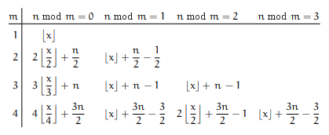
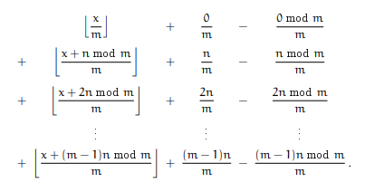
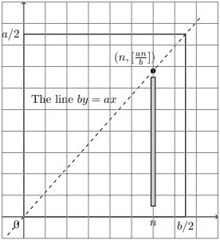
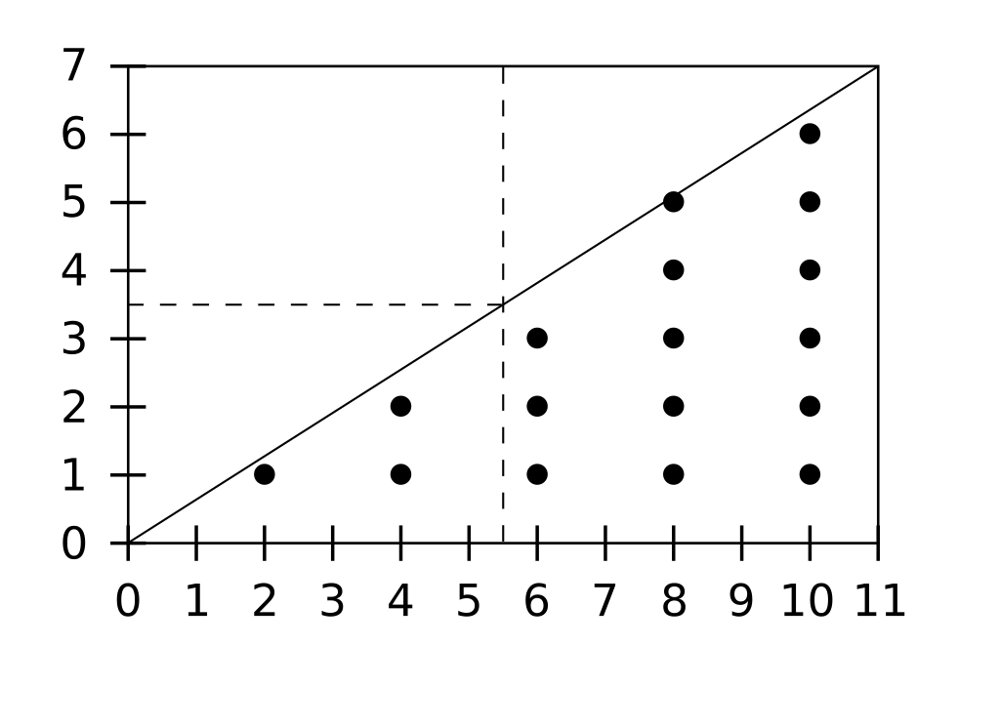

# Quadratic residues

## Euler's Criterion and Legendre symbol

  Refer to [https://crypto.stanford.edu/pbc/notes/numbertheory/qr.html], I couldn't explain them better.
  The only thing which is not clear here is why we have $- 1$ as a quadratic residue if and only if

  $p \equiv 1 \mod 4$

  #### Fast ex.

  $4^2 \equiv -1 \mod 17$

  hence in this case we would have $- 1$ as a residue, indeed

  $(- 1)^{(p - 1)/2} = (- 1)^8 \equiv 1 \mod 17$

  It's quite intuitive at this point to say that if $(p - 1)/2$ is even then we can have $- 1$ as a residue, otherwise we can't. For ex. imagine $(- 1)^3 \equiv - 1 \mod 7$. Indeed $3$ is odd. 

  Now, following [https://math.stackexchange.com/questions/122048/1-is-a-quadratic-residue-modulo-p-if-and-only-if-p-equiv-1-pmod4] we can see that if we have a residue which is $- 1$, then it must be that

  $a^2 \equiv - 1 \mod p$

  And since $(- 1)^2 = 1$, then it must be that

  $a^4 \equiv 1 \mod p$

  which means that we chosed $a \in Z_{q}^{*}$ where $Z_{q}^{\ast}$ is a subgroup of $Z_{p}^{\ast}$ of order $4$. By Lagrange's Theorem it must be that $4|p - 1$, and therefore

  $p \equiv 1 \mod 4$

 ### Extension to $Z_{\phi(p^k)}^{\ast}$

 

   We want to prove that the former section's result holds for powers of odd primes.
   
   $\phi(p^2) = p(p - 1)$

   If

   $a^2 \equiv - 1 \mod p^2$

   then

   $a^4 \equiv 1 \mod p^2$

   therefore by Lagrange $4 | p(p - 1)$, and since $p$ is not divisible by $4$ it must be that $4 | p - 1$, thus

   $p \equiv 1 \mod 4$

   This result can easily be extended to any $p^k$ since

   $\phi(p^3) = p(p(p - 1))$ 
   $\phi(p^4) = p(p(p(p - 1)))$

   and so on.
 

 ### Extension to $Z_{\phi(n)}^{\ast}$

 

   $x^2 \equiv - 1 \mod 2^k$

   is impossible because

   $2 \equiv 2 \mod 4$

   and for $2^k, k > 1$
   
   $2^k \equiv 0 \mod 4$
  
   Now we can finally generalize and say that if

   $n = 2^{k}p_{i}^{k_{i}}$

   for odd distinct primes $p_{i}$, by the CRT, $- 1$ is a quadratic residue iff $k \leq 1$ and each $p_{i} \equiv 1 \mod 4$. The condition $k \leq 1$ is because

   $\phi(2p_{i}^k) = \phi(2)\phi(p_{i}^k) = 1(p(p \dots (p - 1) \dots )) = \phi(p_{i}^k)$

   therefore $2$ is irrelevant and can coexist, while if it was at least $2^2$ we would have

   $x^2 \equiv - 1 \mod 2^2$

   using the CRT; and since it doesn't have solutions we can state that $n$ can't have $- 1$ as quadratic residue (works for any $k$).

   To conclude we can see a similar behaviour between the existence of generators, and the existence of $- 1$ as quadratic residue $(\mod n)$, i.e. if we consider $Z_{\phi(n)}^{\ast}, n = 2^k*\dots, k > 1$ we can't have generators nor $- 1$ as quadratic residue. 
 

 ## Miller-Rabin primality test

 

   This is probably one of the best tests, if not the best to find out if a number is a prime quickly. We take $n$ and a random $a$ in $[2 \dots p - 2]$, if

   $a^{n - 1} \not\equiv 1 \mod n$

   we are done, $n$ is not a prime. Otherwise if it equals $1$, we take $n$ and compute

   $s_{1} = (n - 1) / 2, s_{2} = s_{1} / 2, \dots$

   $r$ times, until we get a number which is not divisible by $2$ (if it's not divisible by $2$ initially then $n$ is not prime and we are done), then we perform

   $a^{s_{i}} \mod n, i = [1, \dots, r]$

   if it equals $1$ we continue until we get $- 1$ at $s_{r}$, otherwise if any

   $a^{s_{i}} \not\equiv 1 \mod n$

   or

   $a^{s_{r}} \not\equiv - 1 \mod n$

   then $n$ is composite. 

   This test exploit the difference between primes subgroups structure and non-primes one, i.e. the structure of subgroups follow $\phi(n)$ is way different between primes and non-primes, thus every time we iterate we are basically breaking the structure and finding random numbers. Also for every iteration the probability to find a number which fools the test decreases exponentially by a factor of $\displaystyle \frac{1}{4}$. I guess that this number derives directly from our reasoning about $p \equiv 1 \mod 4$. Just note this:

   $a^{(n - 1) / 2} \not\equiv a^{\phi(n) / 2}$ for non-primes

   also $- 1$ does not appear around in every multiplicative subgroup, thus it's almost impossible to fool the test. Things should be analyzed better but I don't have the time to do it so for the moment I'm not delving this method further.
 

## Gauss' Lemma

  I'm going straight to the proof here, refer to [https://crypto.stanford.edu/pbc/notes/numbertheory/gausslemma.html]. The linked resource is more than enough, I'm just rewriting the proof for completeness and for study purposes, also I'll provide a couple steps which could seem more intuitive compared to the linked proof.

  Let $p$ an odd prime and $q$ an integer coprime (i.e. every integer in the $[1, \dots, p - 1]$ set is fine). We compute

  $\\{q, q2, \dots, q(p - 1)/2\\} (\mod p)$

  Now we analyze this set, and call $b_1, \dots, b_t$ the elements of the set which are less than $p/2$, and $c_1, \dots, c_u$ the elements which are greater than $p/2$. Every $b_i \neq b_j, c_i \neq c_j (i \neq j)$ (easily provable using the **cancellation law**). Then it must be that
  
  $0 < b_1, \dots, b_t, p - c_1, \dots, p - c_u < p/2$

  and each of these are distinct because if $b_i = p - c_j$ then

  $b_i + c_j = p$ 
  $->$ 
  $b_i + c_j - p = 0$

  but this is impossible because $c_j - p < p/2$ and $b_i < p/2$, hence they must be different. This means that

  $q(q2)\dots (q(p - 1)/2) \equiv (- 1)^{u}b_1 \dots b_t(p - c_1) \dots (p - c_u) (\mod p)$

  because since every 

  $0 < b_1, \dots, b_t, p - c_1, \dots, p - c_u < p/2$

  is different, then they map every number in the set $[1, \dots, (p - 1)/2]$. To set the equality we just need to see how the original $q$ set is the same as this if we consider $(- 1)^u$. 
  Now restarting from

  $q(q2)\dots (q(p - 1)/2) \equiv (- 1)^{u}b_1 \dots b_t(p - c_1) \dots (p - c_u) (\mod p)$ 
  $->$ 
  $q^{(p - 1)/2}((p - 1)/2)! \equiv (- 1)^{u}((p - 1)/2)! (\mod p)$

  Now to safely remove that co-factor we can use the **cancellation law**, i.e. since $((p - 1)/2)! \nmid p$ it must be that

  $q^{(p - 1)/2} \equiv (- 1)^{u} (\mod p)$ _
  
  or using the Legendre Symbol:

  $\displaystyle (\frac{q}{p}) = (- 1)^{u}$
  

## Gauss' Formula

  When he was like $0$ years old Gauss proved that the sum of elements of the set $[1, 2, \dots, n]$ is

  $\displaystyle \frac{n(n + 1)}{2}$

  I don't want to prove this but it's easy (he proved it at $10$ years or something like that, then you can understand it quite easily, as long as he was a genius, a $10$ years old boy can't compete with an average $20$ years old guy). To understand it, do it as a funny math game and find a smart way to compute the sum of numbers from $1$ to $100$. You'll end up finding that formula, and you also could propose this simple problem to your friends (and lose them).

 ## The '2' case of Gauss' Lemma

 

   The problem with the Gauss' Lemma is clearly to know $u$. For $q = 2$ we have
   
   $\displaystyle (\frac{2}{p}) = (- 1)^{(p^2 - 1)/8}$
   
   Let's get why. Restarting from

   $q^{(p - 1)/2}((p - 1)/2)! \equiv ? (\mod p)$

   we can break down $((p - 1)/2)!$ as

   $1 = (- 1)(- 1)$ 
   $2 = (2)(- 1)^2$ 
   $3 = (- 3)(- 1)^3$ 
   $\dots$ 
   $(p - 1)/2 = (p - 1)/2(- 1)^{(p - 1)/2}$

   It's easy to see that the lelft part produces $((p - 1)/2)!$, while for the right part we can further split it and take the left part:

   $- 1$ 
   $2$ 
   $- 3$ 
   $\dots$ 
   $(p - 1)/2$

   Now before considering the $(- 1)^?$ we can introduce our $2$ which substitutes $q$ and note that considering the numbers backwards we get

   $2(p - 1)/2 \mod p = - 1 \mod p$ 
   $2((p - 1)/2 - 1) \mod p = 2(p - 3)/2 \mod p = - 3 \mod p$ 
   $2((p - 1)/2 - 2) \mod p = 2(p - 5)/2 \mod p = - 5 \mod p$ 
   $\dots$ 
   $2((p - 1)/2 - ((p - 1)/2 - 3)) \mod p = 2(6/2) = 6 \mod p$ 
   $2((p - 1)/2 - ((p - 1)/2 - 2)) \mod p = 2(4/2) = 4 \mod p$ 
   $2((p - 1)/2 - ((p - 1)/2 - 1)) \mod p = 2(2/2) = 2 \mod p$ 

   Thus

   $((p - 1)/2)! \equiv (2)(4)(6) \dots (p - 5)(p - 3)(p - 1)(- 1)^{(p^2 - 1)/8} \equiv (- 1)(2)(- 3)(4) \dots ((p - 1)/2)(- 1)^{(p^2 - 1)/8} (\mod p)$ 
   $->$ 
   $2^{(p - 1)/2}((p - 1)/2)! \equiv ((p - 1)/2)!(- 1)^{(p^2 - 1)/8} \mod p$ 
   $->$ 
   $2^{(p - 1)/2} \equiv (- 1)^{(p^2 - 1)/8} \mod p$

   where the second step is quite tricky, and it basically means that
   
   $(2)(4)(6) \dots (p - 5)(p - 3)(p - 1) \equiv (2)(4)(6) \dots (p - 5)(p - 3)(p - 1) (\mod p)$
   
   and $(p^2 - 1)/8$ is derived using the Gauss' Formula:

   $\displaystyle \frac{(p - 1)/2((p - 1)/2 + 1)}{2} = \frac{(p - 1)/2(p + 1)/2}{2} = \frac{p^2 - 1}{8}$

   Now we can further analyze when $(p^2 - 1)/8$ is even. 

   $\displaystyle \frac{p^2 - 1}{8}$ 
   $->$ 
   $\displaystyle \frac{(p - 1)(p + 1)}{8}$ 

   If either $p - 1 | 8$ or $p + 1 | 8$ (can't be both) our result will be matched since both are even. Thus

   $p \pm 1 \equiv 0 \mod 8$ 
   $->$ 
   $p \equiv 1 \mod 8$ or $p \equiv - 1 \mod 8$

   Now, the problem with the initial hypothesis is that we can't be sure it covers every case.
   Let's analyze every other possible case.

   $p \equiv 3 \mod 8$ 
   $->$ 
   $p + 1 \equiv 4 \mod 8$ 
   $p - 1 \equiv 2 \mod 8$

   From the **multiplication property** this would produce $(p - 1)(p + 1) \equiv 0 \mod 8$, and $4 \cdot 2 = 8, 8 / 8 = 1$ which is odd. Now why is this enough to say that the result will be odd? Imagine $(p - 1)/8$ and $(p + 1)/8$ as separated entities, the results will be even or odd, but if we sum these quotients we get an even result. Now since we know that the final remainders will produce an odd result we see that $even + odd = odd$. Same below.

   $p \equiv 5 \mod 8$ 
   $->$ 
   $p + 1 \equiv 6 \mod 8$ 
   $p - 1 \equiv 4 \mod 8$

   From the **multiplication property** this would produce $(p - 1)(p + 1) \equiv 0 \mod 8$, and $6 \cdot 4 = 24, 24 / 8 = 3$ which is odd. Hence we see that if

   $p \equiv \pm 1 \mod 8$

   $2^{(p - 1)/2} \equiv 1 \mod p$

   otherwise if

   $p \equiv \pm 3 \mod 8$

   then

   $2^{(p - 1)/2} \equiv - 1 \mod p$

   

 ## The '3' case

 

   By Gauss' Lemma
   
   $3^{(p - 1)/2} \equiv (- 1)^u \mod p$

   We have the same problem faced above, that is, to find $u$. Recalling that $u$ is the number of elements of the set we seen above which is $> p/2$, we find that (substituting $q$ with $3$) the set we are looking for will be

   $3 \cdot \\{(p - 1)/6 + 1, \dots, (p - 1)/3\\}$

   Thus

   $\displaystyle \frac{p - 1}{3} - \frac{p - 1}{6} = \frac{p - 1}{6}$

   is the number of elements of the previous set. This means that we will end up having

   $3^{(p - 1)/2} \equiv (- 1)^{(p - 1)/6} \mod p$

   Thus we'll have $(p - 1)/6$ even for

   $(p - 1)/6 = 2m$ 
   $->$ 
   $p - 1 = 12m$ 
   $->$ 
   $p \equiv 1 \mod 12$

   Now considering the odd result we would have

   $(p - 1)/6 = 2m + 1$ 
   $->$ 
   $p - 1 = 12m + 6$ 
   $->$ 
   $p \equiv 7 \mod 12$

   Since $7 \mod 12 = - 5 \mod 12$ we end up having

   $3^{(p - 1)/2} \equiv - 1 \mod p$

   if

   $p \equiv - 5 \mod 12$

   and 

   $3^{(p - 1)/2} \equiv 1 \mod p$

   if

   $p \equiv 1 \mod 12$

   These results are partially correct for some arcane reason that we will probably better understand after the following sections. Most of the times very little explanations are made involving this stuff and so I tried to find complete solutions looking around on the web. For more you could also check [http://mathonline.wikidot.com/legendre-symbol-rules-for-3-p-and-6-p#:~:text=Legendre%20Symbol%20(3%2Fp),-Determine%20a%20rule&text=We%20first%20note%20that%20p,or%2011%20(mod%2012).].
   
 

## Eisenstein's Lemma

  
  $a^{(p - 1)/2} \equiv (- 1)^{\sum_{u}\lfloor au/p \rfloor} (\mod p)$

  where

  $\lfloor x \rfloor = floor(x)$

  Let $u$ be any even integer in the set $\\{1, \dots, p - 1\\}$. Let $a$ any positive integer coprime with $p$, and $r(u) = au \mod p$, then

  $(- 1)^{r(u)}r(u)$

  is even. Furthermore every result will be distinct because if

  $au_1 \equiv au_2 \mod p$

  then $p | u_1 - u_2$ which is impossible since they are even. This means that there will be exactly $(p - 1)/2$ results mapped by $r(u)$ and every one of them will be distinct and therefore that these results will be a rearrangement of $\\{2, 4, \dots, p - 1\\}$ since they are all even. Multiplying them we get

  $(- 1)^{r(2)}2a \cdot (- 1)^{r(4)}4a \cdot \dots \cdot (- 1)^{r(p - 1)}(p - 1)a \equiv 2 \cdot 4 \cdot \dots \cdot (p - 1) (\mod p)$

  Using the **cancellation law** we get

  $a^{(p - 1)/2}(- 1)^{r(2) + r(4) + \dots + r(p - 1)} \equiv 1 \mod p$

  This means that $a^{(p - 1)/2}$ always produce a remainder $\pm 1$ which has the same sign as $(- 1)^{r(2) + r(4) + \dots + r(p - 1)}$, and then

  $a^{(p - 1)/2} \equiv (- 1)^{r(2) + r(4) + \dots + r(p - 1)} \mod p$

  Now we can note that 

  $\displaystyle \frac{au}{p} = \lfloor \frac{au}{p} \rfloor + \frac{r(u)}{p}$

  keeping in mind that $au/p$ won't be integer. From this result we can notice that

  $\displaystyle au = p \lfloor \frac{au}{p} \rfloor + r(u)$

  and since $p$ is odd and $u$ even, that $\lfloor au/p \rfloor$ and $r(u)$ are congruent $\mod 2$. To better understand this last step, note that $au$ will be always even, and to get an even result on the right we will need $r(u)$ and $\lfloor au/p \rfloor$ congruent $\mod 2$ (they are both even or odd). This because $p$ is always odd and $odd \cdot odd = odd$, in such case we will necessary have $r(u)$ odd too because $odd + odd = even$ (but $odd + even = odd$). In the case where $\lfloor au/p \rfloor$ will be even we will have $odd \cdot even = even$, therefore if $r(u)$ was odd we would end up having $even + odd = odd$ which is wrong because $au$ is even, and therefore $r(u)$ should be even and finally this means that we necessary have

  $\displaystyle \lfloor \frac{au}{p} \rfloor \equiv r(u) \mod 2$

  This is a more elegant way to prove this fact compared to Gauss' Theorem. 
  Now to finally complete the lemma, since they are congruent $\mod 2$ we can use $\displaystyle \lfloor \frac{au}{p} \rfloor$ instead of $r(u)$ as exponent into the previous result and see that

  $a^{(p - 1)/2} \equiv (- 1)^{\sum_{u}\lfloor au/p \rfloor} (\mod p)$

  where $\sum_{u}\lfloor au/p \rfloor$ is the summation for every $u$ in the set

  $\\{2, 4, \dots, p - 1\\}$

  This result is particularly important because it means that $\sum_{u}\lfloor au/p \rfloor \equiv u \mod 2$, where the $u$ in the left part has nothing to do with the $u$ in the right, that is, the $u$ in the right is the one of the Gauss' Lemma. This means that we can safely use this summation to find if a number is a quadratic residue or not, but the actual power of this will be clearer in the next sections.
  

## Floor function analysis interlude

  Refer to [https://seriouscomputerist.atariverse.com/media/pdf/book/Concrete%20Mathematics.pdf] (~p.90) if anything should not be clear, I'm using this book to understand this subject, and most of this section is literally copy-pasted. Our goal will be to compute

  $\sum_{u}\lfloor qu/p \rfloor$

  where $p$ and $q$ are primes and $u$ is even from $2$ to $p - 1$. But before doing so, let's roll back the reasoning a bit (a lot actually).

  Example: we want to calculate this sum

  $\displaystyle \lfloor \frac{x}{2} \rfloor + \lfloor \frac{x + n}{2} \rfloor$

  We can see that if $n$ is even then this is equal to

  $\displaystyle \lfloor \frac{x}{2} \rfloor + \lfloor \frac{x}{2} \rfloor + \frac{n}{2} = 2\lfloor \frac{x}{2} \rfloor + \frac{n}{2}$

  Otherwise if $n$ is odd then $(n - 1)/2$ is an integer and so

  $\displaystyle \lfloor \frac{x}{2} \rfloor + \lfloor \frac{x + n}{2} \rfloor = \lfloor \frac{x}{2} \rfloor + \lfloor \frac{x + 1 + n - 1}{2} \rfloor = \lfloor \frac{x}{2} \rfloor + \lfloor \frac{x + 1}{2} \rfloor + \frac{n - 1}{2} = 2\lfloor \frac{x}{2} \rfloor + \frac{n - 1}{2}$

  Let's continue the exploration.

  $\displaystyle \lfloor \frac{x}{3} \rfloor + \lfloor \frac{x + n}{3} \rfloor + \lfloor \frac{x + 2n}{3} \rfloor$

  If $n$ is a multiple of $3$, $(n \equiv 0 \mod 3)$ we'll have

  $\displaystyle \lfloor \frac{x}{3} \rfloor + \lfloor \frac{x}{3} \rfloor + \frac{n}{3} + \lfloor \frac{x}{3} \rfloor + \frac{2n}{3} = 3\lfloor \frac{x}{3} \rfloor + \frac{n}{3} + \frac{2n}{3} = 3\lfloor \frac{x}{3} \rfloor + n$

  If $n \equiv 1 \mod 3$ then $(n - 1)/3$ and $(2n - 2)/3$ are integers. The second one is quite intuitive but to be completely sure we can use the **multiplication property** and see that

  $(2 \mod 3)(n \mod 3) \mod 3 \equiv 2 \mod 3$

  then 
  
  $(2 \mod 3)(n \mod 3) - 2 \equiv 0 \mod 3$

  Let's go over, for such case we will have

  $\displaystyle \lfloor \frac{x}{3} \rfloor + \lfloor \frac{x + 1}{3} \rfloor + \frac{n - 1}{3} + \lfloor \frac{x + 2}{3} \rfloor + \frac{2n - 2}{3} = 3\lfloor \frac{x}{3} \rfloor + n - 1$

  Now if $n \equiv 2 \mod 3$ then $(n - 2)/3$ and $(2n - 1)/3$ are integers, to clarify the second

  $(2 \mod 3)(n \mod 3) \mod 3 = 4 \mod 3 \equiv 1 \mod 3$

  then

  $\displaystyle \lfloor \frac{x}{3} \rfloor + \lfloor \frac{x + 2}{3} \rfloor + \frac{n - 2}{3} + \lfloor \frac{x + 1}{3} \rfloor + \frac{2n - 1}{3} = 3\lfloor \frac{x}{3} \rfloor + n - 1$

  To conclude let's analyze the '4' case. If $n \equiv 0 \mod 4$

  $\displaystyle \lfloor \frac{x}{4} \rfloor + \lfloor \frac{x}{4} \rfloor + \frac{n}{4} + \lfloor \frac{x}{4} \rfloor + \frac{2n}{4} + \lfloor \frac{x}{4} \rfloor + \frac{3n}{4} = 4\lfloor \frac{x}{4} \rfloor + \frac{3n}{2}$

  If $n \equiv 1 \mod 4$ then $(n - 1)/4$, $(2n - 2)/4$ and $(3n - 3)/4$ are integers, then

  $\displaystyle \lfloor \frac{x}{4} \rfloor + \lfloor \frac{x + 1}{4} \rfloor + \frac{n - 1}{4} + \lfloor \frac{x + 2}{4} \rfloor + \frac{2n - 2}{4} + \lfloor \frac{x + 3}{4} \rfloor + \frac{3n - 3}{4} = 4\lfloor \frac{x}{4} \rfloor + \frac{3n}{2} - \frac{3}{2}$

  If $n \equiv 2 \mod 4$ then $(n - 2)/4$, $2n/4$ and $(3n - 2)/4$ are integers, then

  $\displaystyle \lfloor \frac{x}{4} \rfloor + \lfloor \frac{x + 2}{4} \rfloor + \frac{n - 2}{4} + \lfloor \frac{x}{4} \rfloor + \frac{2n}{4} + \lfloor \frac{x + 2}{4} \rfloor + \frac{3n - 2}{4} = 4\lfloor \frac{x}{4} \rfloor + \frac{3n}{2} - 1$

  The third case is equivalent to the first because if $n \equiv 3 \mod 4$ then $(n - 3)/4$, $(2n - 2)/4$ and $(3n - 1)/4$ are integers.

  Now we can collect all the previous result and search for some recurrent pattern.

  

  It's easy to see that the general form of the results of the previous summations (I'd rather look at my results and not the ones of the photo because I haven't made some transformation to match the general form in a clearer format [not only actually, also because I don't get them :'D]) is

  $\displaystyle a \lfloor \frac{x}{a} \rfloor + bn + c$

  An accurate analysis of the '4' case shows that

  $\displaystyle \lfloor \frac{x + kn}{m} \rfloor = \lfloor \frac{x + kn \mod m}{m} \rfloor + \frac{kn}{m} - \frac{kn \mod m}{m}$

  is a complete general form. 
  Now we can look at the summation (which is generalized by $k$ in the previous formula) of the general form, for $0 \leq k \leq m - 1$.

  

 ## Law of quadratic reciprocity

 

   Let $p, q$ be two prime numbers. We can see that this is more than enough to state from Eisenstein's Lemma that

   $\displaystyle (\frac{q}{p}) = q^{(p - 1)/2} \equiv (- 1)^{\sum_{u}\lfloor qu/p \rfloor} (\mod p)$

   and

   $\displaystyle (\frac{p}{q}) = p^{(q - 1)/2} \equiv (- 1)^{\sum_{u}\lfloor pu/q \rfloor} (\mod q)$

   $->$

   $\displaystyle (\frac{q}{p})(\frac{p}{q}) = (- 1)^{\sum_{u}\lfloor qu/p \rfloor + \sum_{u}\lfloor pu/q \rfloor}$

  ### Proof of the Law of QR using Eisenstein's lattice points and some basic floor function theory

   Assuming $q > p$, we have

   $q \mod p = q - kp \mod p$

   where 

   $\displaystyle kp = p \lfloor \frac{q}{p} \rfloor$ 
   $->$ 
   $\displaystyle q \mod p = q - p \lfloor \frac{q}{p} \rfloor$

   and by the **multiplication property** is easy to see that

   $\displaystyle 2q \equiv 2q - 2p \lfloor \frac{q}{p} \rfloor \mod p$

   Now, since our formula is
   
   $\sum_{u}\lfloor qu/p \rfloor$
   
   we can try to extract something from $\displaystyle \lfloor \frac{qu}{p} \rfloor$ using the same tactic of the previous section about the floor function, and see that

   $\displaystyle q \mod p = q - p \lfloor \frac{q}{p} \rfloor$ 
   $->$ 
   $\displaystyle \lfloor \frac{q}{p} \rfloor = \lfloor \frac{q - (q - p \lfloor \frac{q}{p} \rfloor) + (q - p \lfloor \frac{q}{p} \rfloor)}{p} \rfloor = \lfloor \frac{q - p \lfloor \frac{q}{p} \rfloor}{p} \rfloor + \lfloor \frac{q}{p} \rfloor$

   where $\displaystyle q - (q - p \lfloor \frac{q}{p} \rfloor)$ is clearly an integer divisible by $p$. The same goes for 

   $\displaystyle 2q \equiv 2q - 2p \lfloor \frac{q}{p} \rfloor \mod p$ 
   $->$ 
   $\displaystyle \lfloor \frac{2q}{p} \rfloor = \lfloor \frac{2q - (2q - 2p \lfloor \frac{q}{p} \rfloor) + (2q - 2p \lfloor \frac{q}{p} \rfloor)}{p} \rfloor = \lfloor \frac{2q - 2p \lfloor \frac{q}{p} \rfloor}{p} \rfloor + 2\lfloor \frac{q}{p} \rfloor$

   where $\displaystyle 2q - (2q - 2p \lfloor \frac{q}{p} \rfloor)$ is an integer divisible by $p$, and $\displaystyle \lfloor \frac{2q}{p} \rfloor$ clearly matches our Eisenstein's summation terms form. 
   It results that
   
   $\displaystyle \lfloor \frac{2q - 2p \lfloor \frac{q}{p} \rfloor}{p} \rfloor = 0$ 
   $\displaystyle \lfloor \frac{4q - 4p \lfloor \frac{q}{p} \rfloor}{p} \rfloor = 0$ 
   $\dots$ 
   $\displaystyle \lfloor \frac{(p - 1)q - (p - 1)p \lfloor \frac{q}{p} \rfloor}{p} \rfloor = 0$

   This means that

   $\displaystyle \lfloor \frac{2q}{p} \rfloor = 2\lfloor \frac{q}{p} \rfloor$ 
   $\displaystyle \lfloor \frac{4q}{p} \rfloor = 4\lfloor \frac{q}{p} \rfloor$ 
   $\dots$ 
   $\displaystyle \lfloor \frac{(p - 1)q}{p} \rfloor = (p - 1)\lfloor \frac{q}{p} \rfloor$ 

   [[Little extra]]
   
   Rewriting the formula of the previous section adapted for our case, we get

   $\displaystyle \lfloor \frac{kq}{p} \rfloor = \lfloor \frac{kq \mod p}{p} \rfloor + \frac{kq}{p} - \frac{kq \mod p}{p}$

   indeeed we see that

   $\displaystyle \lfloor \frac{q}{p} \rfloor = \frac{kq}{p} - \frac{kq \mod p}{p}$

   because

   $\displaystyle \lfloor \frac{q}{p} \rfloor = \frac{kq}{p} - \frac{kq \mod p}{p} = \frac{q}{p} - (\frac{q - p \lfloor \frac{q}{p} \rfloor}{p}) = \lfloor \frac{q}{p} \rfloor$

   [[end of extra]]

   Since the previous result, we can now rewrite

   $\sum_{u}\lfloor qu/p \rfloor$

   as

   $\displaystyle 2\lfloor \frac{q}{p} \rfloor + 4\lfloor \frac{q}{p} \rfloor + 6\lfloor \frac{q}{p} \rfloor + \dots + (p - 1)\lfloor \frac{q}{p} \rfloor$

   It's clear that such summation will be even, thus we can safely remove it from the calculation, since it doesn't change the parity of the exponent. The viceversa would be obviously the same $(p > q)$.

   Let's now take

   $\sum_{u}\lfloor pu/q \rfloor$

   into analysis. If $q > p$, $p$ will be something of the form $q - 2m$ for some $1 \leq m < (q - 1)/2 \mapsto 1 \leq m \leq (q - 3)/2$ (because we need to remove the case of $p$ being $1$). Now let's quickly consider our last summation term case $\displaystyle \lfloor \frac{p(q - 1)}{q} \rfloor$. A fast check enables us to see two corner cases, that is, $p = q - 2$ and $p = 3$ results for the last term of the summation.

   $\displaystyle \lfloor \frac{(q - 2)(q - 1)}{q} \rfloor = \lfloor \frac{q^2 - 3q + 2}{q} \rfloor = q - 3 = p - 1$

   and

   $\displaystyle \lfloor \frac{3(q - 1)}{q} \rfloor = \lfloor \frac{3q - 3}{q} \rfloor = 2 = p - 1$

   It results clear that the final result will always be $p - 1$ and I'm pretty sure it could be formalyzed somehow. For ex. imagine $5(y - 1)/y, y > 5$. We basically took $y - 1, 5$ times, then imagine to keep removing $y$; we will basically remove $y - 1 (+ 1)$ every step therefore having necessarily a result which is $p - 1$ (floor function erasing the last step remainder). Now we can further note another strange behaviour of this summation (which is one of the hardest thing to understand about this theorem). Let $p = 3$ and $q = 79$, it's quite clear that we will have a lot of terms of the summation equal to $0$, indeed

   $\displaystyle \lfloor \frac{3(2)}{79} \rfloor = 0$ 
   $\displaystyle \lfloor \frac{3(4)}{79} \rfloor = 0$ 
   $\displaystyle \lfloor \frac{3(6)}{79} \rfloor = 0$ 
   $\dots$ 
   $\displaystyle \lfloor \frac{3(78)}{79} \rfloor = 2 = p - 1$ (with an ereased remainder of $76$)
   
   In general the potential cases of difference between $q$ and $p$ varies up to infinity, thus how do we manage to solve this¿ One really big problem is that we can't know in general when

   $\lfloor pu/q \rfloor = 1$
   
   If you take a quick look at [https://en.wikipedia.org/wiki/Proofs_of_quadratic_reciprocity] you'll find out that they took $\sum_{u}\lfloor qu/p \rfloor$ because they set $p = 11, q = 7$, thus $p > q$, which is the viceversa of my assumption. Also, they set such primes not randomly at all. That's probably the most 'good looking' case you can find having $q$ which is strictly bigger than $q - (q - 1)/2$. For some reason which I'm not going to delve because they would complicate the proof further, we can see that

   $\displaystyle \lfloor \frac{7(2)}{11} \rfloor = 1$ 

   Thus at the first term of the summation we already have a $1$ which could simplify the proof for some reasons (not considering corner cases which Wiki covers by the way, infact their proof is not easy to understand) but it's not the general case; IMHO we should always delve the worst cases to show how something works. Now, having said this clarification, in general we can't know when we will end up having 

   $\lfloor pu/q \rfloor = 1$

   as I already said and also we can't know in general when we will start facing $2, 3, \dots$ etc. Then how can we solve this? It turns out that we don't need to know it (but just because of Eisenstein's intuitions). The most important thing to understand is that

   $\lfloor pu/q \rfloor$

   is a pseudo-linear function. Imagine to substitute $u$ with $x$ in the cartesian graph and remove the floor function; we would end up having a function which is represented by this formula:

   $y = px/q$

   or

   $y = x(p/q)$

   which better clarify how $y$ is basically a linear function (it's a straight line) and how $x$ is scaled by the (constant) $p/q$ factor. We can note that this function basically differs from ours in two things being the floor function, and $u$ which is basically $x$ taken at even numbers from $2$ to $q - 1$, which means that the major difference lies into the floor function.
   
   

   *Where a = p, b = q and the shadowed rectangle should be one of the values of our floored function (which sucks as image because it looks like not being an integer and the x value not being even)*
   
   We can easily see that 'the flooring' mechanism is quite easy after all, that is, we know that $xp/q$ will never be an integer because $xp$ and $q$ don't share divisors, which means that our initial function mapped into the cartesian graph (starting from our derived one) will basically be the derived one where every result at $x$ even is the same but removing the fractional part. Now if we start drawing such line in the graph starting from $2$ that would be an error because we would implicitly set $x_0 = 2$, that is $2$ would represent the zero, indeed $0$ will be our starting point. Also since everything just said, it's not trivial to see that if we connect $y = \lfloor pu/q \rfloor$ points we basically draw a polygon inside a rectangle with corners at $\\{(0,0), (q - 1, 0), (0, p - 1), (q - 1, p - 1)\\}$ which (the polygon) splits the rectangle in half. It's really important to understand the connection between this polygon, and the triangle drawn by $y = px/q$ because their area will be the same ;).
   
   

   *This image from Wiki is really good to understand everything. Here p = 11, q = 7. The points showed are the results of our floored function at those x values.*
   
   Understanding such 'linearity' / 'corrispondence between the polygon and the triangle', basically solves this nightmare theorem. Before going into the last step, imagine having $\lfloor pu/q \rfloor = 1$ at some point strictly before $q/2$ in the $x-axis$, i.e. at $(q - 1)/2$. After that point we know by the linearity of the function that we will end up having another result which is equal to the previous if the previous was $(p - 1)/2$, or equal to $p - 1 - previous = next$. By the same reasoning, if we had some integer result $> 0$ at for ex. $(q - 9)/2 = (q - 1)/2 - 4$ (which means that we would have $3$ integer results before $q/2$, i.e. at $\\{(q - 1)/2, (q - 5)/2, (q - 9)/2\\}$) we can almost be sure that by the linearity we will have
   
   $\displaystyle \lfloor \frac{p(q - 9)/2}{q} \rfloor + \lfloor \frac{p(q + 9)/2}{q} \rfloor = p - 1$

   The reason why I took $(q - 9)/2$ instead of $(q - 1)/2$ or $(q + 1)/2$ is left for you to understand. It will be clearer proceeding to the end.

   All this remembering that I'm not $100\\%$ sure $(99\\%)$ it will be always the case this equality works, but for sure (here I'm $100\\%$) the poligon created by connecting the point of $\lfloor pu/q \rfloor$ in the cartesian graph will split the rectangle mentioned previously in a half (which is the most important part which solves the theorem). Now we can also dissect the previous example to show everything with an abstract microscope.

   $\displaystyle \lfloor \frac{3(2)}{79} \rfloor = 0$ 
   $\displaystyle \lfloor \frac{3(4)}{79} \rfloor = 0$ 
   $\displaystyle \lfloor \frac{3(6)}{79} \rfloor = 0$ 
   $\displaystyle \lfloor \frac{3(8)}{79} \rfloor = 0$ 
   $\dots$ 
   $\displaystyle \lfloor \frac{3(26)}{79} \rfloor = 0$ 
   $\displaystyle \lfloor \frac{3(28)}{79} \rfloor = 1 = p - 1 - 1$ 
   $\dots$ 
   $\displaystyle \lfloor \frac{3(52)}{79} \rfloor = 1 = p - 1 - 1$ 
   $\displaystyle \lfloor \frac{3(54)}{79} \rfloor = 2 = p - 1$ 
   $\dots$ 
   $\displaystyle \lfloor \frac{3(72)}{79} \rfloor = 2 = p - 1$ 
   $\displaystyle \lfloor \frac{3(74)}{79} \rfloor = 2 = p - 1$ 
   $\displaystyle \lfloor \frac{3(76)}{79} \rfloor = 2 = p - 1$ 
   $\displaystyle \lfloor \frac{3(78)}{79} \rfloor = 2 = p - 1$ (with an ereased remainder of $76$)
   
   Hence taking $q/2 = 39.5$ we can see

   $\\{28, 30, 32, 34, 36, 38, \\{39.5\\}, !40!, 42, 44, 46, 48, 50, 52\\}$

   Our simmetry which we were talking about is clearly visible, and $40$ is the element which basically determines $\displaystyle (\frac{79}{3})(\frac{3}{79}) = - 1$.
   
   There's just one step dividing us from the final result, that is, our rectangle mentioned previously is collapsible into the rectangle with corners at

   $\\{(0,0), ((q - 1)/2, 0), (0, p - 1), ((q - 1)/2, p - 1)\\}$

   (preserving the parity because we actually just moved the elements which is fair). Now we can see that our lattice points create a dense set of points which basically represent our polygon mentioned above (which in turn represents the triangle which splits in half our new rectangle having the lenght halved). Thus we can proceed calculating the area and finding the solution of the theorem.

   $\displaystyle \frac{((q - 1)/2)(p - 1)}{2} = \frac{(q - 1)(p - 1)}{4}$

   and therefore

   $\displaystyle (\frac{q}{p})(\frac{p}{q}) = (- 1)^{\frac{(q - 1)(p - 1)}{4}}$

 

 ## Further conclusions and Jacobi symbol

 

   
 

 

