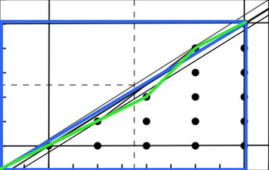

# Quadratic residues concepts

## Euler's Criterion and Legendre symbol

  Refer to [https://crypto.stanford.edu/pbc/notes/numbertheory/qr.html], I couldn't explain them better.
  The only thing which is not clear here is why we have $- 1$ as a quadratic residue if and only if

  $p \equiv 1 \mod 4$

  #### Quick ex.

  $4^2 \equiv -1 \mod 17$

  hence in this case we would have $- 1$ as a residue, indeed

  $(- 1)^{(p - 1)/2} = (- 1)^8 \equiv 1 \mod 17$

  It's quite intuitive at this point to say that if $(p - 1)/2$ is even then we can have $- 1$ as a residue, otherwise we can't. For ex. imagine $(- 1)^3 \equiv - 1 \mod 7$. Indeed $3$ is odd. 

  Now, following [https://math.stackexchange.com/questions/122048/1-is-a-quadratic-residue-modulo-p-if-and-only-if-p-equiv-1-pmod4] we can see that if we have a residue which is $- 1$, then it must be that

  $a^2 \equiv - 1 \mod p$

  And since $(- 1)^2 = 1$, then it must be that

  $a^4 \equiv 1 \mod p$

  which means that we chosed $a \in Z_{q}^{*}$ where $Z_{q}^{\ast}$ is a subgroup of $Z_{p}^{\ast}$ of order $4$. By Lagrange's Theorem it must be that $4|p - 1$, and therefore

  $p \equiv 1 \mod 4$

 ### Extension to $Z_{\phi(p^k)}^{\ast}$

 

   We want to prove that the former section's result holds for powers of odd primes.
   
   $\phi(p^2) = p(p - 1)$

   If

   $a^2 \equiv - 1 \mod p^2$

   then

   $a^4 \equiv 1 \mod p^2$

   therefore by Lagrange $4 | p(p - 1)$, and since $p$ is not divisible by $4$ it must be that $4 | p - 1$, thus

   $p \equiv 1 \mod 4$

   This result can easily be extended to any $p^k$ since

   $\phi(p^3) = p(p(p - 1))$ 
   $\phi(p^4) = p(p(p(p - 1)))$

   and so on.
 

 ### Extension to $Z_{\phi(n)}^{\ast}$

 

   $x^2 \equiv - 1 \mod 2^k$

   is impossible because

   $2 \equiv 2 \mod 4$

   and for $2^k, k > 1$
   
   $2^k \equiv 0 \mod 4$
  
   Now we can finally generalize and say that if

   $n = 2^{k}p_{i}^{k_{i}}$

   for odd distinct primes $p_{i}$, by the CRT, $- 1$ is a quadratic residue iff $k \leq 1$ and each $p_{i} \equiv 1 \mod 4$. The condition $k \leq 1$ is because

   $\phi(2p_{i}^k) = \phi(2)\phi(p_{i}^k) = 1(p(p \dots (p - 1) \dots )) = \phi(p_{i}^k)$

   therefore $2$ is irrelevant and can coexist, while if it was at least $2^2$ we would have

   $x^2 \equiv - 1 \mod 2^2$

   using the CRT; and since it doesn't have solutions we can state that $n$ can't have $- 1$ as quadratic residue (works for any $k$).

   To conclude we can see a similar behaviour between the existence of generators, and the existence of $- 1$ as quadratic residue $(\mod n)$, i.e. if we consider $Z_{\phi(n)}^{\ast}, n = 2^k*\dots, k > 1$ we can't have generators nor $- 1$ as quadratic residue. 
 

 ## Miller-Rabin primality test

 

   This is probably one of the best tests, if not the best to find out if a number is a prime quickly. We take $n$ and a random $a$ in $[2 \dots p - 2]$, if

   $a^{n - 1} \not\equiv 1 \mod n$

   we are done, $n$ is not a prime. Otherwise if it equals $1$, we take $n$ and compute

   $s_{1} = (n - 1) / 2, s_{2} = s_{1} / 2, \dots$

   $r$ times, until we get a number which is not divisible by $2$ (if it's not divisible by $2$ initially then $n$ is not prime and we are done). Simultaneously we perform

   $a^{s_{i}} \mod n, i = [1, \dots, r]$

   If it equals $1$ we continue until we get $- 1$ which could be up to $s_{r}$, otherwise if we get

   $a^{s_{i}} \not\equiv 1 \mod n$

   before obtaining $- 1$ then $n$ is composite. [If we keep getting

   $a^{s_{i}} \equiv 1 \mod n$

   but not $- 1$ at $s_{r}$ then $n$ is composite too, even though I'm not sure if it's possible].
   
   This test exploit the difference between primes subgroups structure and non-primes one, i.e. the structure of subgroups follow $\phi(n)$ but $\phi(n)$ is different between primes and non-primes, thus every time we iterate we are basically breaking the structure and finding random numbers. Also for every iteration the probability to find a number which fools the test decreases exponentially by a factor of $\displaystyle \frac{1}{4}$. I guess that this number derives directly from our reasoning about $p \equiv 1 \mod 4$ (not sure at all). Just note this:

   $a^{(n - 1) / 2} \not\equiv a^{\phi(n) / 2}$ for non-primes

   also $- 1$ does not appear around in every multiplicative subgroup, thus it's almost impossible to fool the test. Things should be analyzed better but I don't have the time to do it so for the moment I'm not delving this method further.
 

## Gauss' Lemma

  I'm going straight to the proof here, refer to [https://crypto.stanford.edu/pbc/notes/numbertheory/gausslemma.html]. The linked resource is more than enough, I'm just rewriting the proof for completeness and for study purposes, also I'll provide a couple steps which could seem more intuitive compared to the linked proof.

  Let $p$ an odd prime and $q$ an integer coprime (i.e. every integer in the $[1, \dots, p - 1]$ set is fine). We compute

  $\\{q, q2, \dots, q(p - 1)/2\\} (\mod p)$

  Now we analyze this set, and call $b_1, \dots, b_t$ the elements of the set which are less than $p/2$, and $c_1, \dots, c_u$ the elements which are greater than $p/2$. Every $b_i \neq b_j, c_i \neq c_j (i \neq j)$ (easily provable using the **cancellation law**). Then it must be that
  
  $0 < b_1, \dots, b_t, p - c_1, \dots, p - c_u < p/2$

  and each of these are distinct because if $b_i = p - c_j$ then

  $b_i + c_j = p$ 
  $->$ 
  $b_i + c_j - p = 0$

  but this is impossible because $c_j - p < p/2$ and $b_i < p/2$, hence they must be different. This means that

  $q(q2)\dots (q(p - 1)/2) \equiv (- 1)^{u}b_1 \dots b_t(p - c_1) \dots (p - c_u) (\mod p)$

  because since every 

  $0 < b_1, \dots, b_t, p - c_1, \dots, p - c_u < p/2$

  is different, then they map every number in the set $[1, \dots, (p - 1)/2]$. To set the equality we just need to see how the original $q$ set is the same as this if we consider $(- 1)^u$. 
  Now restarting from

  $q(q2)\dots (q(p - 1)/2) \equiv (- 1)^{u}b_1 \dots b_t(p - c_1) \dots (p - c_u) (\mod p)$ 
  $->$ 
  $q^{(p - 1)/2}((p - 1)/2)! \equiv (- 1)^{u}((p - 1)/2)! (\mod p)$

  Now to safely remove that co-factor we can use the **cancellation law**, i.e. since $((p - 1)/2)! \nmid p$ it must be that

  $q^{(p - 1)/2} \equiv (- 1)^{u} (\mod p)$ _
  
  or using the Legendre Symbol:

  $\displaystyle (\frac{q}{p}) = (- 1)^{u}$
  

## Gauss' Formula

  When he was like $0$ years old Gauss proved that the sum of elements of the set $[1, 2, \dots, n]$ is

  $\displaystyle \frac{n(n + 1)}{2}$

  I don't want to prove this but it's easy (he proved it at $10$ years or something like that, then you can understand it quite easily, as long as he was a genius, a $10$ years old boy can't compete with an average $20$ years old guy). To understand it, do it as a funny math game and find a smart way to compute the sum of numbers from $1$ to $100$. You'll end up finding that formula, and you also could propose this simple problem to your friends (and lose them).

 ## The '2' case of Gauss' Lemma

 

   The problem with the Gauss' Lemma is clearly to know $u$. For $q = 2$ we have
   
   $\displaystyle (\frac{2}{p}) = (- 1)^{(p^2 - 1)/8}$
   
   Let's get why. Restarting from

   $q^{(p - 1)/2}((p - 1)/2)! \equiv ? (\mod p)$

   we can break down $((p - 1)/2)!$ as

   $1 = (- 1)(- 1)$ 
   $2 = (2)(- 1)^2$ 
   $3 = (- 3)(- 1)^3$ 
   $\dots$ 
   $(p - 1)/2 = (p - 1)/2(- 1)^{(p - 1)/2}$

   It's easy to see that the lelft part produces $((p - 1)/2)!$, while for the right part we can further split it and consider the left part:

   $- 1$ 
   $2$ 
   $- 3$ 
   $\dots$ 
   $(p - 1)/2$

   Now we can see that introducing the $2$ into the series we get

   $2(p - 1)/2 \mod p = - 1 \mod p$ 
   $2((p - 1)/2 - 1) \mod p = 2(p - 3)/2 \mod p = - 3 \mod p$ 
   $2((p - 1)/2 - 2) \mod p = 2(p - 5)/2 \mod p = - 5 \mod p$ 
   $\dots$ 
   $2((p - 1)/2 - ((p - 1)/2 - 3)) \mod p = 2(6/2) = 6 \mod p$ 
   $2((p - 1)/2 - ((p - 1)/2 - 2)) \mod p = 2(4/2) = 4 \mod p$ 
   $2((p - 1)/2 - ((p - 1)/2 - 1)) \mod p = 2(2/2) = 2 \mod p$ 

   which means that basically multiplying every term by $2$ reproduce our initial series of terms (without the $(- 1)^{?}s$) thus not altering the result. 
   Hence

   $2^{(p - 1)/2}((p - 1)/2)! \equiv ((p - 1)/2)!(- 1)^{(p^2 - 1)/8} \mod p$ 
   $->$ 
   $2^{(p - 1)/2} \equiv (- 1)^{(p^2 - 1)/8} \mod p$

   where $(p^2 - 1)/8$ is derived using the Gauss' Formula:

   $\displaystyle \frac{(p - 1)/2((p - 1)/2 + 1)}{2} = \frac{(p - 1)/2(p + 1)/2}{2} = \frac{p^2 - 1}{8}$

   Now we can further analyze when $(p^2 - 1)/8$ is even. 

   $\displaystyle \frac{p^2 - 1}{8}$ 
   $->$ 
   $\displaystyle \frac{(p - 1)(p + 1)}{8}$ 

   If either $p - 1 | 8$ or $p + 1 | 8$ (can't be both) our result will be matched since both are even. Thus

   $p \pm 1 \equiv 0 \mod 8$ 
   $->$ 
   $p \equiv 1 \mod 8$ or $p \equiv - 1 \mod 8$

   Now, the problem with the initial hypothesis is that we can't be sure it covers every case.
   Let's analyze every other possible case.

   $p \equiv 3 \mod 8$ 
   $->$ 
   $p + 1 \equiv 4 \mod 8$ 
   $p - 1 \equiv 2 \mod 8$

   From the **multiplication property** this would produce $(p - 1)(p + 1) \equiv 0 \mod 8$, and $4 \cdot 2 = 8, 8 / 8 = 1$ which is odd. Now why is this enough to say that the result will be odd? Imagine $(p - 1)/8$ and $(p + 1)/8$ as separated entities, the results will be even or odd, but if we sum these quotients we get an even result. Now since we know that the final remainders will produce an odd result we see that $even + odd = odd$. Same below. 
   I was quite unsure about this explanations but I'm going to leave this as it is. I believe that this reasoning is almost similar/the same as the Quadratic Reciprocity one you'll find later, and it's interesting that I found it before knowing anything about the Reciprocity Law. Still unsure by the way but I think it's correct (the results are correct by the way).

   $p \equiv 5 \mod 8$ 
   $->$ 
   $p + 1 \equiv 6 \mod 8$ 
   $p - 1 \equiv 4 \mod 8$

   From the **multiplication property** this would produce $(p - 1)(p + 1) \equiv 0 \mod 8$, and $6 \cdot 4 = 24, 24 / 8 = 3$ which is odd. Hence we see that if

   $p \equiv \pm 1 \mod 8$

   $2^{(p - 1)/2} \equiv 1 \mod p$

   otherwise if

   $p \equiv \pm 3 \mod 8$

   then

   $2^{(p - 1)/2} \equiv - 1 \mod p$

   

 ## The '3' case

 

   By Gauss' Lemma
   
   $3^{(p - 1)/2} \equiv (- 1)^u \mod p$

   We have the same problem faced above, that is, to find $u$. Recalling that $u$ is the number of elements of the set we seen above which is $> p/2$, we find that (substituting $q$ with $3$) the set we are looking for will be

   $3 \cdot \\{(p - 1)/6 + 1, \dots, (p - 1)/3\\}$

   Thus

   $\displaystyle \frac{p - 1}{3} - \frac{p - 1}{6} = \frac{p - 1}{6}$

   is the number of elements of the previous set. This means that we will end up having

   $3^{(p - 1)/2} \equiv (- 1)^{(p - 1)/6} \mod p$

   Thus we'll have $(p - 1)/6$ even for

   $(p - 1)/6 = 2m$ 
   $->$ 
   $p - 1 = 12m$ 
   $->$ 
   $p \equiv 1 \mod 12$

   Now considering the odd result we would have

   $(p - 1)/6 = 2m + 1$ 
   $->$ 
   $p - 1 = 12m + 6$ 
   $->$ 
   $p \equiv 7 \mod 12$

   Since $7 \mod 12 = - 5 \mod 12$ we end up having

   $3^{(p - 1)/2} \equiv - 1 \mod p$

   if

   $p \equiv - 5 \mod 12$

   and 

   $3^{(p - 1)/2} \equiv 1 \mod p$

   if

   $p \equiv 1 \mod 12$

   These results are partially correct for some reason (I guess I should analyze better the negative cases). You'll find the complete answer to this problem some sections below, so you're fine to go over. Also, the resolution method below is way better because is formalyzed and structured. Computing Gauss' $u$ is clearly not the way to go.
   
 

## Eisenstein's Lemma

  
  $a^{(p - 1)/2} \equiv (- 1)^{\sum_{u}\lfloor au/p \rfloor} (\mod p)$

  where

  $\lfloor x \rfloor = floor(x)$

  Let $u$ be any even integer in the set $\\{1, \dots, p - 1\\}$. Let $a$ any positive integer coprime with $p$, and $r(u) = au \mod p$, then

  $(- 1)^{r(u)}r(u)$

  is even. Furthermore every result will be distinct because if

  $au_1 \equiv au_2 \mod p$

  then $p | u_1 - u_2$ which is impossible since they are even. This means that there will be exactly $(p - 1)/2$ results mapped by $r(u)$ and every one of them will be distinct and therefore that these results will be a rearrangement of $\\{2, 4, \dots, p - 1\\}$ since they are all even. Multiplying them we get

  $(- 1)^{r(2)}2a \cdot (- 1)^{r(4)}4a \cdot \dots \cdot (- 1)^{r(p - 1)}(p - 1)a \equiv 2 \cdot 4 \cdot \dots \cdot (p - 1) (\mod p)$

  Using the **cancellation law** we get

  $a^{(p - 1)/2}(- 1)^{r(2) + r(4) + \dots + r(p - 1)} \equiv 1 \mod p$

  This means that $a^{(p - 1)/2}$ always produce a remainder $\pm 1$ which has the same sign as $(- 1)^{r(2) + r(4) + \dots + r(p - 1)}$, and then

  $a^{(p - 1)/2} \equiv (- 1)^{r(2) + r(4) + \dots + r(p - 1)} \mod p$

  Now we can note that 

  $\displaystyle \frac{au}{p} = \lfloor \frac{au}{p} \rfloor + \frac{r(u)}{p}$

  keeping in mind that $au/p$ won't be integer. From this result we can notice that

  $\displaystyle au = p \lfloor \frac{au}{p} \rfloor + r(u)$

  and since $p$ is odd and $u$ even, that $\lfloor au/p \rfloor$ and $r(u)$ are congruent $\mod 2$. To better understand this last step, note that $au$ will be always even, and to get an even result on the right we will need $r(u)$ and $\lfloor au/p \rfloor$ congruent $\mod 2$ (they are both even or odd). This because $p$ is always odd and $odd \cdot odd = odd$, in such case we will necessary have $r(u)$ odd too because $odd + odd = even$ (but $odd + even = odd$). In the case where $\lfloor au/p \rfloor$ will be even we will have $odd \cdot even = even$, therefore if $r(u)$ was odd we would end up having $even + odd = odd$ which is wrong because $au$ is even, and therefore $r(u)$ should be even and finally this means that we necessary have

  $\displaystyle \lfloor \frac{au}{p} \rfloor \equiv r(u) \mod 2$

  Now to finally complete the lemma, since they are congruent $\mod 2$ we can use $\displaystyle \lfloor \frac{au}{p} \rfloor$ instead of $r(u)$ as exponent into the previous result and see that

  $a^{(p - 1)/2} \equiv (- 1)^{\sum_{u}\lfloor au/p \rfloor} (\mod p)$

  where $\sum_{u}\lfloor au/p \rfloor$ is the summation for every $u$ in the set

  $\\{2, 4, \dots, p - 1\\}$

  This result is particularly important because it means that $\sum_{u}\lfloor au/p \rfloor \equiv u \mod 2$, where the $u$ in the left part has nothing to do with the $u$ in the right, that is, the $u$ in the right is the one of the Gauss' Lemma. This means that we can safely use this summation to find if a number is a quadratic residue or not, but the actual power of this will be clearer in the next sections.
  

 ## Law of quadratic reciprocity

 

   Let $p, q$ be two prime numbers. We can see that this is more than enough to state from Eisenstein's Lemma that

   $\displaystyle (\frac{q}{p}) = q^{(p - 1)/2} \equiv (- 1)^{\sum_{u}\lfloor qu/p \rfloor} (\mod p)$

   and

   $\displaystyle (\frac{p}{q}) = p^{(q - 1)/2} \equiv (- 1)^{\sum_{u}\lfloor pu/q \rfloor} (\mod q)$

   $->$

   $\displaystyle (\frac{q}{p})(\frac{p}{q}) = (- 1)^{\sum_{u}\lfloor qu/p \rfloor + \sum_{u}\lfloor pu/q \rfloor}$ 
   $->$ 
   $\displaystyle (\frac{q}{p})(\frac{p}{q}) = (- 1)^{\frac{(q - 1)(p - 1)}{4}}$

  ### Expl. of the Law of QR using Eisenstein's lattice points
   
   Let's take

   $\sum_{u}\lfloor pu/q \rfloor$

   into analysis. If $q > p$, $p$ will be something of the form $q - 2m$ for some $1 \leq m < (q - 1)/2 \mapsto 1 \leq m \leq (q - 3)/2$ (because we need to remove the case of $p$ being $1$). Let's consider our last summation term case $\displaystyle \lfloor \frac{p(q - 1)}{q} \rfloor$. A quick check enables us to see two corner cases, that is, $p = q - 2$ and $p = 3$ results for the last term of the summation.

   $\displaystyle \lfloor \frac{(q - 2)(q - 1)}{q} \rfloor = \lfloor \frac{q^2 - 3q + 2}{q} \rfloor = q - 3 = p - 1$

   and

   $\displaystyle \lfloor \frac{3(q - 1)}{q} \rfloor = \lfloor \frac{3q - 3}{q} \rfloor = 2 = p - 1$ 
   
   It results clear that the final result will always be $p - 1$ and I'm pretty sure it could be formalyzed somehow. For ex. imagine $5(y - 1)/y, y > 5$. We basically took $y - 1, 5$ times, then imagine to keep removing $y$; we will basically remove $y - 1 (+ 1)$ every step therefore having necessarily a result which is $4$ $[p - 1]$ (remember the floor function erasing the last step remainder). Now we start the madness seeing one corner-case example. Let $p = 3$ and $q = 79$, it's quite clear that we will have a lot of terms of the summation equal to $0$, indeed

   $\displaystyle \lfloor \frac{3(2)}{79} \rfloor = 0$ 
   $\displaystyle \lfloor \frac{3(4)}{79} \rfloor = 0$ 
   $\displaystyle \lfloor \frac{3(6)}{79} \rfloor = 0$ 
   $\dots$ 
   $\displaystyle \lfloor \frac{3(78)}{79} \rfloor = 2 = p - 1$ (with an ereased remainder of $76$)
   
   In general the potential cases of difference between $q$ and $p$ varies up to infinity which limits our power of analysis quite a bit. 
   
   If you take a quick look at [https://en.wikipedia.org/wiki/Proofs_of_quadratic_reciprocity] you'll find out that they took $\sum_{u}\lfloor qu/p \rfloor$ because they set $p = 11, q = 7$, thus $p > q$, which is the viceversa of my assumption. We can see that the Wiki example produce (reversing $p$ and $q$ is safe and easy)
   
   $\displaystyle \lfloor \frac{7(2)}{11} \rfloor = 1$ 

   at the first term of the summation. In general we can't know exactly when we will end up having 

   $\lfloor pu/q \rfloor = 1$

   and also we can't know in general when we will start facing $2, 3, \dots$ etc. but it turns out that we don't need to know it to derive the solution of the theorem. The most important thing to understand is that

   $\lfloor pu/q \rfloor$

   is a pseudo-linear function. Imagine to substitute $u$ with $x$ in the cartesian graph and remove the floor function; we would end up having a function which is represented by this formula:

   $y = px/q$

   or

   $y = x(p/q)$

   which better clarify how $y$ is basically a linear function (it's a straight line) and how $x$ is scaled by the (constant) $p/q$ factor. We can note that this function basically differs from ours in two things being the floor function, and $u$ which is basically $x$ taken at even numbers from $2$ to $q - 1$, which means that the major difference lies into the floor function. 
   We can easily see that 'the flooring' mechanism is quite easy after all, that is, we know that $xp/q$ will never be an integer because $xp$ and $q$ don't share divisors, which means that our initial function mapped into the cartesian graph (starting from our derived one) will basically be the derived one where every result at $x$ even is the same but removing the fractional part. This is better clarified by seeing the Wiki example, which shows the lattice points under our derived $y = x(p/q)$ formula which (the lattice points) represent the results of our initial formula $\lfloor pu/q \rfloor$. Wiki uses $q = 7, p = 11$, and therefore you can safely swap them and consider $q = 11, p = 7$ which follows our reasoning (without imagining them swapped in the picture, just focus on it like it is, it's fine).
   
   
   
   My initial goal was to show the simmetry of our function $\lfloor pu/q \rfloor$ in the cartesian graph, since to prove this theorem we will calculate the area of a triangle which splits a rectangle having corners at $\\{(0,0), ((q - 1)/2, 0), (0, p - 1), ((q - 1)/2, p - 1)\\}$. These coordinates are not a starting point of course, but it's quite easy to roll back the reasoning and find the initial coordinates which you can easily find into the previous picture, that is $\\{(0,0), (q - 1, 0), (0, p - 1), (q - 1, p - 1)\\}$. Thus we will basically divide the length of the rectangle $(R)$ by $2$, really hard I know. Well, the funny part here is that the problem is right before splitting the rectangle in half. I said that my goal was to show some simmetry, since as I said initially the floor function is basically a pseudo-linear function, hence we should necessary find that it divides $R$ (which is drawable connecting the previous coordinates) in half. Thus we should find a polygon which splits the initial $R$ in half (I specified 'initial' because the derived one is just the initial one with the length halved, thus the simmetry should be individuable into the first $R$ already). Since that polygon splits $R$ in half, its area should be the same as the triangle defined by the diagonal of $R$. Now, after many battles, I understood a basic reality. If the number of lattice points is $odd$ we will never find a way to find a simmetry connecting the top of the (different $x$ coordinates) lattice points (and drawing our polygon) which is trivial because I'm telling you this after risking my mental sanity :'D. Thus, why do we calculate the area of the triangle mentioned previously in either case? Before asking this question, let me show you the real simmetry and equivalence of the polygon defined by the lattice points. In order to achieve this under the Wiki example, I basically added the point which makes the number of lattice points even, because (spoiler) $\displaystyle (\frac{11}{7})(\frac{7}{11}) = - 1$. Indeed the number of lattice points is $odd$ and the simmetry is impossible under the correct conditions.
   
   

   You can clearly see how the red line splits the rectangle $\\{(0,0), (q - 1, 0), (0, p - 1), (q - 1, p - 1)\\}$ in half (diagonal shown in blue). This means that grouping every set of vertical lattice points into the first half of points in the $x-axis$ produce the triangle which splits the rectangle at $\\{(0,0), ((q - 1)/2, 0), (0, p - 1), ((q - 1)/2, p - 1)\\}$ in half, as you can see below ($\lfloor pu/q \rfloor$ in green | diagonal of the rectangle in cyan).

   

   This whole reasoning means that

   $\sum_{u} \lfloor pu/q \rfloor _{even} = (p - 1)(q - 1)/4$
   
   $->$
   
   $\sum_{u} \lfloor pu/q \rfloor \equiv (p - 1)(q - 1)/4 \mod 2$

   because

   $\sum_{u} \lfloor pu/q \rfloor _{even} \equiv 0 \mod 2$ 
   $->$ 
   $(p - 1)(q - 1)/4 = \lfloor pu/q \rfloor _{even} \equiv 0 \mod 2$ 

   and

   $\sum_{u} \lfloor pu/q \rfloor _{odd} \equiv 1 \mod 2$ 
   $->$ 
   $(p - 1)(q - 1)/4 = \lfloor pu/q \rfloor _{even} + 1 \equiv \lfloor pu/q \rfloor _{odd} \equiv 1 \mod 2$ 
   
   Below you can clearly see that the simmetry is impossible under correct conditions (for this particular example) and it also better clarifies the formulas above. 
   
   

   An equivalent construction can be derived for $\lfloor qu/p \rfloor$, reversing $p$ and $q$, which produces

   $\sum_{u} \lfloor qu/p \rfloor \equiv (p - 1)(q - 1)/4 \mod 2$
   
   Considering our results, it follows that

   $\displaystyle \sum_{u} \lfloor qu/p \rfloor \equiv \frac{(q - 1)(p - 1)}{4} = \frac{q - 1}{2}\frac{p - 1}{2} \mod 2$ 
   $\displaystyle \sum_{u} \lfloor pu/q \rfloor \equiv \frac{(q - 1)(p - 1)}{4} = \frac{q - 1}{2}\frac{p - 1}{2} \mod 2$

   and we had

   $\displaystyle (\frac{q}{p})(\frac{p}{q}) = (- 1)^{\sum_{u}\lfloor qu/p \rfloor}(- 1)^{\sum_{u}\lfloor pu/q \rfloor}$ 
   $and$ 
   $\displaystyle (\frac{q}{p})(\frac{p}{q}) = (- 1)^{\sum_{u}\lfloor qu/p \rfloor + \sum_{u}\lfloor pu/q \rfloor}$

   It follows that
   
   $\displaystyle (\frac{q}{p})(\frac{p}{q}) = (- 1)^{\frac{(q - 1)(p - 1)}{4}}$ _

   which solves the theorem, because
   
   $\displaystyle (\frac{q}{p})(\frac{p}{q}) = - 1$
   
   implies

   $\displaystyle (\frac{q}{p}) = - (\frac{p}{q})$

   and $- 1$ as result is only possible if $q \equiv p \equiv - 1 \mod 4$ because if $q \equiv 1 \mod 4$ and/or $p \equiv 1 \mod 4$ it would mean that $4|q - 1$ and/or $4|p - 1$ which would make $\frac{(q - 1)(p - 1)}{4}$ even.
   The final result of the theorem is a forced artifice (hence it's not) to consider $\frac{(q - 1)(p - 1)}{4}$ only one time, because this is the only way to preserve the logic of operations and the result of the QR theorem, because if we have both $q \equiv p \equiv - 1 \mod 4$ which we know is the only way to have $- 1$ as result, then we are forced to consider $\frac{(q - 1)(p - 1)}{4}$ only once, because following basic math properties we have

   $\displaystyle (\frac{q}{p})(\frac{p}{q}) = (- 1)^{\sum_{u}\lfloor qu/p \rfloor}(- 1)^{\sum_{u}\lfloor pu/q \rfloor}$ 
   $and$ 
   $\displaystyle (\frac{q}{p})(\frac{p}{q}) = (- 1)^{\sum_{u}\lfloor qu/p \rfloor + \sum_{u}\lfloor pu/q \rfloor}$

   and the second one would invalidate the first if not considering $\frac{(q - 1)(p - 1)}{4}$ once, while if we have $q \equiv 1 \mod 4$ and/or $p \equiv 1 \mod 4$ then the result is always even and $\frac{(q - 1)(p - 1)}{4}$ doesn't alter this result. It's like if when reaching

   $\displaystyle \sum_{u} \lfloor qu/p \rfloor \equiv \frac{(q - 1)(p - 1)}{4} = \frac{q - 1}{2}\frac{p - 1}{2} \mod 2$ 
   $\displaystyle \sum_{u} \lfloor pu/q \rfloor \equiv \frac{(q - 1)(p - 1)}{4} = \frac{q - 1}{2}\frac{p - 1}{2} \mod 2$

   god is basically telling us 'hey you should consider $\frac{(q - 1)(p - 1)}{4}$ only once'.

   Ex:
   
   $\displaystyle (\frac{11}{7})(\frac{7}{11}) = (11^3 \mod 7)(7^5 \mod 11) = (1 \mod 7)(- 1 \mod 11) = - 1$

   Indeed both $(p - 1)/2$ and $(q - 1)/2$ are odd preserving our reasoning, but at the same time one of them equals $1$ not $- 1$.
   
   There are different proof of QR which could be more consistent. I believe that Rousseau one deserves a try (not easy at all, but little background is involved). You can find it here [https://stacky.net/files/115/RousseauQR.pdf].

   After many battles I decided to call this section 'Explanation' and not proof because there are a couple things missing, and other ones which should be mathematically proved. One thing I suggest you if you're reading this, is to use the formula below to better show mathematically the number of lattice points which end up being over the diagonal of $R$. Also, you can directly check our derived formulas in action by looking at the first example at [https://crypto.stanford.edu/pbc/notes/numbertheory/quadrecip.html] which computes the Legendre Symbol of $\displaystyle (\frac{31}{103})$.

   [[Extra]]

   The formula of the diagonal of the first $R$ is
   
   $y = (p - 1)x/(q - 1)$
   
 

 ## Jacobi Symbol

 

 At this point the Jacobi Symbol should be easily understandable by looking at its definition at [https://crypto.stanford.edu/pbc/notes/numbertheory/quadrecip.html]. Nontheless, the example showed at the end of the chapter is not straightforward imho. Thus, if you find it challenging you can look at my dissection below. I'll dispose the steps vertically providing explanations horizontally.

 $\displaystyle (\frac{31}{103})$ 
 $\displaystyle - (\frac{103}{31})$ --- follows from QR since $103 \equiv - 1 \mod 4$ and $31 \equiv - 1 \mod 4$ 
 $\displaystyle - (\frac{- 21}{31})$ --- because $103 \equiv 10 \mod 21$ and $10 = - 21 \mod 31$ 
 $\displaystyle - (\frac{- 1}{31})(\frac{21}{31})$ --- because $A^n \cdot B^n = (AB)^n$ [https://math.stackexchange.com/questions/4166313/multiplying-numbers-with-different-bases-with-the-same-exponent]. 
 $\displaystyle (\frac{31}{21})$ --- because $\displaystyle - (\frac{- 1}{31})(\frac{21}{31}) = - (\frac{- 1}{31})- (\frac{31}{21}) = - (\frac{- 1}{31})- (\frac{- 1}{21})(\frac{31}{21}) = (\frac{- 1}{31})(\frac{- 1}{21})(\frac{31}{21}) = (- 1)^{15 \cdot 10}(\frac{31}{21}) = (\frac{31}{21})$ 
 $\displaystyle (\frac{- 11}{21})$ --- because $31 \equiv 10 \mod 21$ and $10 = - 11 \mod 21$ 
 $\displaystyle (\frac{- 1}{21})(\frac{11}{21})$ --- same procedure shown above 
 $\displaystyle (\frac{21}{11})$ --- same procedure shown above (applied QR) 
 $\displaystyle (\frac{- 1}{11})$ --- $21 \equiv 10 = - 1 \mod 11$ 
 $- 1$ --- applied Legendre Symbol formula, i.e. $(- 1)^{(11 - 1)/2}$

 This procedure basically allows us to compute the Jacobi/Legendre Symbol without factoring. Honestly I guess that there's some reason missing behind this because we could have done $(31^{51} \mod 103) \cdot (103^{15} \mod 31) = - 1 \cdot 1 = - 1$. It looks pretty clear that for huge numbers this could be really expensive and that's probably the reason behind those transforms made in the exercise.
 

 ## Using our new power to complete the '3' case of Gauss' Lemma

 

   We want to know when 
   
   $3^{(p - 1)/2} \mod p = 1 \mod p$ 
   $3^{(p - 1)/2} \mod p = - 1 \mod p$

   We can calc. from the previous section

   $\displaystyle (\frac{3}{p}) = - (\frac{p}{3}) = (\frac{- 1}{3})(\frac{p}{3})$

   Now

   $(- 1)^{(3 - 1)/2} \mod 3 = - 1 \mod 3$ 
   $p^{(3 - 1)/2} \mod 3 = p \mod 3$

   which means that $\displaystyle (\frac{3}{p}) = 1$ if $p \equiv - 1 \mod 3$, otherwise $\displaystyle (\frac{3}{p}) = - 1$ if $p \equiv 1 \mod 3$. Now, we know from the previous section that the previous step $\displaystyle (\frac{3}{p}) = - (\frac{p}{3})$ is safe iff $p \equiv - 1 \mod 4$. Now we can exhume the CRT.
   
_ 1st case, clear conditions to satisfy $\displaystyle (\frac{3}{p}) = 1$ _
 
   $p \equiv 2 \mod 3$ 
   $p \equiv 3 \mod 4$ 
   $p \equiv ? \mod 12$ 
   $-----$ 
   $N = 4$ 
   $n = ?$ 
   $4n - z3 = 1$ 
   $-----$ 
   $N = 3$ 
   $n = ?$ 
   $3n - z4 = 1$ 
   $-----$ 
   $2 \cdot 4 \cdot 1 + 3 \cdot 3 \cdot 3 \mod 12$ 
   $->$ 
   $8 + 27 \mod 12$ 
   $->$ 
   $- 1 \mod 12$ 

_ 2nd case, negative conditions multiplied to satisfy $\displaystyle (\frac{3}{p}) = 1$ _
 
   $p \equiv 1 \mod 3$ 
   $p \equiv 1 \mod 4$ 
   $p \equiv ? \mod 12$

 Without wasting our life, we know this is

   $p \equiv 1 \mod 12$

_ 3rd case, hybrid conditions multiplied to satisfy $\displaystyle (\frac{3}{p}) = - 1$ _
 
   $p \equiv 2 \mod 3$ 
   $p \equiv 1 \mod 4$ 
   $p \equiv ? \mod 12$ 
   $-----$ 
   $N = 4$ 
   $n = ?$ 
   $4n - z3 = 1$ 
   $-----$ 
   $N = 3$ 
   $n = ?$ 
   $3n - z4 = 1$ 
   $-----$ 
   $2 \cdot 4 \cdot 1 + 1 \cdot 3 \cdot 3 \mod 12$ 
   $->$ 
   $8 + 9 \mod 12$ 
   $->$ 
   $5 \mod 12$

_ 4th case, hybrid conditions multiplied to satisfy $\displaystyle (\frac{3}{p}) = - 1$ _

   $p \equiv 1 \mod 3$ 
   $p \equiv 3 \mod 4$ 
   $p \equiv ? \mod 12$ 
   $-----$ 
   $N = 4$ 
   $n = ?$ 
   $4n - z3 = 1$ 
   $-----$ 
   $N = 3$ 
   $n = ?$ 
   $3n - z4 = 1$ 
   $-----$ 
   $1 \cdot 4 \cdot 1 + 3 \cdot 3 \cdot 3 \mod 12$ 
   $->$ 
   $5 + 27 \mod 12$ 
   $->$ 
   $8 \mod 12$ 
   $->$ 
   $- 5 \mod 12$

   Which finally means that we managed to compute all the cases for $\displaystyle (\frac{3}{p})$:

   $\displaystyle (\frac{3}{p}) = 1$

   if

   $p \equiv \pm 1 \mod 12$

   otherwise

   $\displaystyle (\frac{3}{p}) = - 1$

   if

   $p \equiv \pm 5 \mod 12$
 

 ## Tonelli-Shanks root square algorithm

 

   This section refers to [https://en.wikipedia.org/wiki/Tonelli%E2%80%93Shanks_algorithm] (not entirely, the proof is different).
   
   In the previous sections we faced the problem of knowing whether a number is a quadratic residue or not, and many conditions involved in the process of understanding it. Now we want to actually compute $R$ where

   $R^2 \equiv n \mod p$

   that is, to find the root square of $n$ $(\mod p)$.

   Imagine a scenario where we want to compute the square root of $n$, but we are not sure if it is a quadratic residue. From the previous sections, we know this won't be a problem because we can easily check it using the Euler's Criterion (or Jacobi Symbol).

   We can start by factoring out $p - 1$ the powers of $2$, obtaining

   $p - 1 = 2^{S}Q$

   where $Q$ is odd.
   
   Now we can analyze the first and perhaps most important intuition.

   If

   $\displaystyle R \equiv n^{\frac{Q + 1}{2}} \mod p$ &nbsp;&nbsp;&nbsp;&nbsp;&nbsp;&nbsp; $[1.1]$

   then
   
   $R^2 \equiv n^{Q + 1} = (n)(n^{Q}) \mod p$ &nbsp;&nbsp;&nbsp;&nbsp;&nbsp;&nbsp; $[1.2]$

   Now, if

   $n^{Q} \equiv 1 \mod p$ &nbsp;&nbsp;&nbsp;&nbsp;&nbsp;&nbsp; $[1.3]$

   then

   $R^2 \equiv n \mod p$

   which would mean that we would have found $R$ $([1.1])$. 
   Now the first question that came to my mind was how can we manage to get $[1.3]$, which is indeed the only problem here. We can see that

   $\displaystyle n^{Q^{2^{S - 1}}} = n^{Q2^{S - 1}} = n^{\frac{p - 1}{2}}$

   This means that $n^{Q}$ is the $S - 1$-th square root of $n^{\frac{p - 1}{2}}$, and
   
   $\displaystyle n^{\frac{p - 1}{2}} \equiv 1 \mod p$

   because $n$ is a quadratic residue.

   Now we can observe that either

   $4 | p - 1$ &nbsp;&nbsp;&nbsp;&nbsp;&nbsp;&nbsp; $[1.4]$ 
   $->$ 
   $p \equiv 1 \mod 4$

   or

   $2 | p - 1$ &nbsp;&nbsp;&nbsp;&nbsp;&nbsp;&nbsp; $[1.5]$ 
   $but$ 
   $4 \nmid p - 1$ 
   $->$ 
   $p - 1 \equiv 2 \mod 4$ 
   $->$ 
   $p \equiv - 1 \mod 4$

   We can see that under $[1.5]$ we will have

   $p - 1 = 2Q$

   and

   $\displaystyle R \equiv n^{\frac{Q + 1}{2}} \mod p$ 
   $->$ 
   $\displaystyle R^2 \equiv (n)(n^{Q}) \mod p$ 
   $->$ 
   $\displaystyle R^2 \equiv n \mod p$

   because

   $\displaystyle n^{Q} = n^{\frac{p - 1}{2}}$

   thus, under $[1.5]$ our formula will always resolve without problems. Wiki reports
   
   $\displaystyle R \equiv \pm n^{\frac{p + 1}{4}} \mod p$ &nbsp;&nbsp;&nbsp;&nbsp;&nbsp;&nbsp; $[1.6]$

   under $[1.5]$, because

   $\displaystyle R^2 \equiv n^{\frac{p + 1}{2}} \mod p$ 
   $->$ 
   $\displaystyle R^2 \equiv (n)(n^{\frac{p - 1}{2}}) \mod p$

   where $\pm$ is because of the square and $\displaystyle Q = \frac{p - 1}{2}$ for this particular case.
   
   Now, what's the problem if we use this formula for every case? That is, why don't we always set $\displaystyle Q = \frac{p - 1}{2}$ and compute $[1.6]$?

   If $[1.4]$ then

   $4 | p - 1$ 
   $and$ 
   $2 | p + 1$ 
   $->$ 
   $2 | p - 1$ 
   $but$ 
   $4 \nmid p + 1$

   This means that we can't use $[1.6]$. Otherwise if $[1.5]$ then accidentally

   $2 | p - 1$ 
   $and$ 
   $4 | p + 1$
   
   This means that we will need to find another way under $[1.4]$. 
   Now I'll proceed analyzing the algorithm which solves both cases by the way.
   
   Let $z$ be a quadratic non-residue of $Z_{p}^{*}$, that is

   $z^{\frac{p - 1}{2}} \equiv - 1 \mod p$

   Now, before going over, some clarifications are necessary in order clarify the bigger picture, which is not simple.

   The most important and hard thing to realize is that not every quadratic non-residue will help us finding the right answer. We will need to find one which matches

   $n^{Q} = z^{2Q}$ 
   $->$ 
   $\sqrt{n^{Q}} = z^{Q}$

   that is, $z^{Q}$ is the square root of $n^{Q}$. 
   Now, before going over, I'll give you a wider view of the problem (which is really tough). We know that 

   $n^{Q2^{S - 1}} \equiv 1 \mod p$ &nbsp;&nbsp;&nbsp;&nbsp;&nbsp;&nbsp; $[1.7]$

   but $n$ will produce a subgroup of $Z_{p}^{\ast}$, of order $o$ such that

   $o_{n} | Q2^{S - 1}$

   This means that we will necessarily find another $1$ before $[1.7]$ for every $n$ which doesn't belong to some subgroup $S$ of $Z_{p}^{\ast}$ of order $o_{S} = Q2^{S - 1}$. For such cases we will have 

   - $n^{Q2^{i}} \equiv 1 \mod p$
   - $i < S - 1$
   - $i | S - 1$

   (erasing the cases producing $n^{Q} \equiv 1 \mod p$ since it's trivial). 
   Now the reasoning starts getting quite hard, and I believe there must be some rule which could rely on complex numbers. Since

   $n^{Q2^{i}} \equiv 1 \mod p$

   we will necessarily have

   $n^{Q2^{i - 1}} \equiv - 1 \mod p$

   but we can't know (for the moment) what $n^{Q}$ will be because the square of $- 1$ falls into complex numbers. Now, for the same reason we can't know what $z^{2Q}$ will be in general, and therefore we will need to check its adequacy. Even the reasoning about quadratic non-residues starts getting quite obscure if we dig enough. [To get what I mean, fire up Zn.py using $41$ and check $4$. We can easily state that its root is $2$, but it doesn't follow the non-residues reasoning]. Let's get over this for the moment because the reasoning is complex enough already. Recalling the initial statement, we will need to find a non-residue $z$ such that

   $n^{Q} = z^{2Q}$ 
   $->$ 
   $\sqrt{n^{Q}} = z^{Q}$

   so let's get why. 
   The construction made by Wikipedia is not completely necessary to get the final result; we will only need to compute $b$, $R$ and $Rb$. The constructions regarding $c, t$ are only necessary to better show why the algorithm works from a formal point of view, hence I'm leaving them because they improve the proof, but they are not required if you want to implement Tonelli-Shanks. 

   Now I'm going to breakdown the algorithm from a formal point of view which will be the proof itself.

   Initially we set
   
   $M = S$ 
   $c = z^{Q}$ 
   $t = n^{Q}$ 
   $R = n^{\frac{Q + 1}{2}}$

   If $t = 1$ return $R$ ($[1.5]$ will be solved here), otherwise we keep squaring on $t$ to find the first $i$ which matches

   $t^{2^{i}} \equiv 1 \mod p$

   then we proceed with the algorithm assigning
   
   $b = c^{2^{M - i - 1}} = z^{Q^{2^{M - i - 1}}} = z^{Q^{2^{S - i - 1}}}$ 
   $M = i$ 
   $c = b^2 = (z^{Q^{2^{S - i - 1}}})^2$ 
   $t = tb^2 = n^{Q}(z^{Q^{2^{S - i - 1}}})^2$ 
   $R = Rb = n^{\frac{Q + 1}{2}}z^{Q^{2^{S - i - 1}}}$

   $i$ times, where our result will be found on the last iteration.

   We can further analyze the algorithm on the $2nd$ step:

   $b = c^{2^{i - (i - 1) - 1}} = c = (z^{Q^{2^{S - i - 1}}})^2$ 
   $M = i - 1$ 
   $c = b^2 = (z^{Q^{2^{S - i - 1}}})^4$ 
   $t = tb^2 = n^{Q}(z^{Q^{2^{S - i - 1}}})^2(z^{Q^{2^{S - i - 1}}})^4$ 
   $R = Rb = n^{\frac{Q + 1}{2}}z^{Q^{2^{S - i - 1}}}(z^{Q^{2^{S - i - 1}}})^2$

   $3rd$ step:

   $b = c^{2^{i - 1 - (i - 2) - 1}} = c = (z^{Q^{2^{S - i - 1}}})^4$ 
   $M = i - 2$ 
   $c = b^2 = (z^{Q^{2^{S - i - 1}}})^8$ 
   $t = tb^2 = n^{Q}(z^{Q^{2^{S - i - 1}}})^2(z^{Q^{2^{S - i - 1}}})^4(z^{Q^{2^{S - i - 1}}})^8$ 
   $R = Rb = n^{\frac{Q + 1}{2}}z^{Q^{2^{S - i - 1}}}(z^{Q^{2^{S - i - 1}}})^2(z^{Q^{2^{S - i - 1}}})^4$

   $4t\lambda$ step and so on:

   $b = c^{2^{i - 2 - (i - 3) - 1}} = c = (z^{Q^{2^{S - i - 1}}})^8$ 
   $M = i - 3$ 
   $c = b^2 = (z^{Q^{2^{S - i - 1}}})^{16}$ 
   $t = tb^2 = n^{Q}(z^{Q^{2^{S - i - 1}}})^2(z^{Q^{2^{S - i - 1}}})^4(z^{Q^{2^{S - i - 1}}})^8(z^{Q^{2^{S - i - 1}}})^{16}$ 
   $R = Rb = n^{\frac{Q + 1}{2}}z^{Q^{2^{S - i - 1}}}(z^{Q^{2^{S - i - 1}}})^2(z^{Q^{2^{S - i - 1}}})^4(z^{Q^{2^{S - i - 1}}})^8$

   We must repeat these assignments $i$ times, therefore obtaining
   
   - $c = (c^{2^{S - i - 1}})^{2^{i}}$
   - - $c^{2^{S - i - 1 + i}}$
     - $c^{2^{S - 1}}$
     - $z^{Q2^{S - 1}} \equiv - 1 \mod p$
   - $t = tb^2 = n^{Q}(z^{Q^{2^{S - i - 1}}})^{2^{i}}$
   - - $z^{Q^{2}}z^{Q^{2^{S - 1}}} <-$ you can see here that everything works since $n^{Q} \equiv z^{2Q} \mod p$
     - $Z = z^{Q^{2}}$
     - $Z \cdot Z^{S - 1} = Z^{S}$
     - $z^{Q2^{S}} \equiv 1 \mod p$
    
   Now we can make a simple artifice and consider the result for $Rb$ squared, while reminding that it will exactly be the square root of it. This is made to prove the algorithm, since the final result is proved by

   $R^2 \equiv n \mod p$

   This means that if we have the result of the algorithm which squared matches the previous result then the proof is complete and the algorithm works.
  
   - $R = Rb = n^{\frac{Q + 1}{2}}(c^{2^{S - i - 1}})^{2^{i - 1}}$
   - $-artifice>$
   - $R^2 = R^{2}b^{2} = n^{Q + 1}(c^{2^{S - i - 1}})^{2^{i}}$
   - - $(n)(n^{Q})(c^{2^{S - i - 1}})^{2^{i}}$
   - - $(n)1 \mod p$
     - $n \mod p$ _
    
   There could be some other conclusions which could be made, since

   $n^{Q} \equiv z^{2Q} \mod p$

   doesn't necessarily mean that $z$ must be a quadratic non-residue.
   
 

